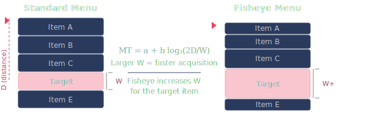
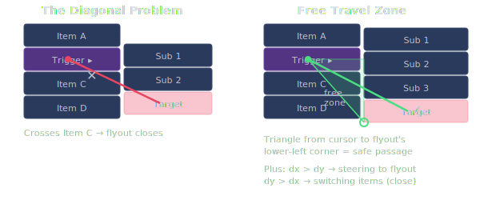

# Fisheye Flyout Menu


Luxuriously usable cascading menus. Items dynamically resize based on mouse proximity, applying **Fitts's Law** to reduce target acquisition time in deep menu hierarchies. Travel to the flyout menu is enabled with a free zone computed with trigonometry. Mouse targets are carefully preserved even as the menu animates. Full keyboard navigation with ARIA roles for screen reader accessibility.

**[Live Demo](https://andyed.github.io/fisheye-menu/)**

## Fitts's Law Primer

Paul Fitts showed in 1954 that the time to move to a target depends on two things: how far away it is (D) and how big it is (W).



The formula:

    MT = a + b · log₂(2D / W)

In a standard menu, every item has the same height (W). The item at the bottom of a long list has high D and unchanged W — slow to reach. A fisheye menu increases W for the item you're approaching, reducing acquisition time without changing the menu's total footprint.

The effect compounds across cascading menus. Each submenu level adds distance. Fisheye sizing at every level means the cumulative penalty stays manageable instead of growing exponentially with depth.

## The Tunneling Problem

Cascading menus have a second failure mode: the diagonal path. When you move from a parent item toward a flyout submenu, your mouse crosses other parent items along the way — which close the flyout you were heading toward. Users learn to move right first, then down, adding a dogleg that doubles the motor cost.



This implementation computes a **steering corridor** — a trapezoidal safe zone that expands from the trigger item toward the full height of the flyout. While the mouse is inside the corridor, item-enter events on the parent panel are suppressed. You can move diagonally to any part of the submenu without triggering a close.

The corridor boundaries are interpolated linearly using the mouse's horizontal progress between the parent panel edge and the flyout edge. Vertical padding adds forgiveness for motor imprecision.

This is a well-known technique in HCI, predating Amazon's 2013 patent (now expired) on a specific mega-menu implementation. The geometric insight — protect the user's diagonal path to a submenu — follows directly from Fitts's and Accot-Zhai's steering law research and was taught in human factors curricula by the early 1990s.

## Background

This approach was originally prototyped as a "fisheye menu" during Andy Edmonds' MS research in Human Factors at Clemson University, exploring mouse-position-dependent target sizing in hierarchical menus ([2005 prototype screenshot](https://www.flickr.com/photos/andyed/26420728/)). The core insight: if you make the item the user is heading toward taller, and ensure the boundaries they'd cross don't shift against them, you get faster traversal without sacrificing menu density.

## Configuration

All behavior is controlled via the `CONFIG` object in `fisheye-menu.js`:

| Parameter | Default | Description |
|-----------|---------|-------------|
| `baseHeight` | 28 | Default item height in pixels |
| `maxExpand` | 2.4 | Maximum expansion factor for hovered item |
| `minHeight` | 21 | Minimum compressed height (readability floor) |
| `falloffRadius` | 4 | Number of neighbors that get partial expansion |
| `transitionMs` | 80 | CSS transition duration |
| `separator` | `'line'` | Item separator style: `false`, `'line'`, or `'groove'` |
| `separatorColor` | `'rgba(255,255,255,0.08)'` | Separator color |
| `separatorThickness` | 1 | Separator thickness in pixels |

## Demo Taxonomies

The demo includes several real-world hierarchies for testing at various depths and item counts:

- **Biology** — Linnaean taxonomy (Kingdom → Order), 4 levels deep
- **Chemistry** — Periodic table element groups
- **Typography** — Typeface classification (Vox-ATypI style)
- **Dewey Decimal** — Library classification system
- **Palettes** — Color themes from [Psychodeli+](https://github.com/andyed/psychodeli-webgl-port) with visual swatches

## Usage

No build step. ES6 modules — import and call `create()`:

```html
<div id="my-menu"></div>

<script type="module">
import { create } from './fisheye-menu.js';

const menu = create(document.getElementById('my-menu'), [
  { label: 'File', children: [
    { label: 'New' },
    { label: 'Open' },
    { label: 'Recent', children: [
      { label: 'document.txt' },
      { label: 'notes.md' },
    ]},
    { label: 'Save' },
  ]},
  { label: 'Edit', children: [
    { label: 'Undo' },
    { label: 'Redo' },
    { label: 'Find' },
  ]},
], {
  onSelect: (item) => console.log('Selected:', item.label),
});

// Later: menu.destroy() to clean up
</script>
```

### Data format

Each menu item is an object with:
- `label` — display text (required)
- `children` — array of child items (makes it a submenu trigger)
- `swatch` — `[r, g, b]` array to show a color dot (optional)

Use the string `'---'` for a separator.

### Options

All options are optional. See the [Configuration](#configuration) table for layout parameters. Additional options:

| Option | Default | Description |
|--------|---------|-------------|
| `onSelect` | `null` | `(item) => {}` — called when a leaf item is clicked or Enter'd |
| `overlay` | `false` | Dim the background when a menu is open |
| `theme` | `'dark'` | `'dark'`, `'light'`, or `null` to inherit your own CSS custom properties |
| `debug` | `false` | Show live height values in an overlay |

### Cleanup

`create()` returns an object with a `destroy()` method that removes all DOM elements and event listeners.

### Styles

Include `fisheye-menu.css` for the default dark theme:

```html
<link rel="stylesheet" href="fisheye-menu.css">
```

The stylesheet uses CSS custom properties (`--fisheye-*`) for all colors. Override any variable on an ancestor element for custom theming, or pass `theme: null` and define your own values. All layout is handled by JS — the stylesheet controls appearance only. Menu panels are appended to `document.body` for correct positioning.

## References

- Fitts, P. M. (1954). The information capacity of the human motor system in controlling the amplitude of movement. *Journal of Experimental Psychology*, 47(6), 381–391.

- Bederson, B. B. (2000). [Fisheye menus](https://dl.acm.org/doi/10.1145/354401.354782). *Proceedings of UIST 2000*, 217–225. The original fisheye menu concept — magnifying items near the cursor in linear lists.

- Ahlström, D., Alexandrowicz, R., & Hitz, M. (2005). [Modeling and improving selection in cascading pull-down menus using Fitts' law, the steering law and force fields](https://dl.acm.org/doi/10.1145/1054972.1054982). *Proceedings of CHI 2005*. Fitts's law analysis of cascading menu traversal.

- Cockburn, A., & Gutwin, C. (2007). [Untangling the usability of fisheye menus](https://dl.acm.org/doi/10.1145/1275511.1275512). *ACM Transactions on Computer-Human Interaction*, 14(2). Found Dock-style fisheye menus slower than traditional menus — but tested a variant where magnification distorts spatial layout. Our approach differs: total menu height is fixed, only proportions shift, preserving spatial memory.

- Tanvir, E., Cullen, J., Irani, P., & Cockburn, A. (2011). [Improving cascading menu selections with adaptive activation areas](https://www.sciencedirect.com/science/article/abs/pii/S1071581911000772). *International Journal of Human-Computer Studies*, 69(12), 769–785. Triangular activation areas for diagonal submenu access — the steering corridor technique.

- Accot, J., & Zhai, S. (1997). Beyond Fitts' law: Models for trajectory-based HCI tasks. *Proceedings of CHI 1997*, 295–302. The steering law: movement time through a tunnel is proportional to tunnel length/width. Foundational for understanding cascading menu traversal costs.

## License

MIT
